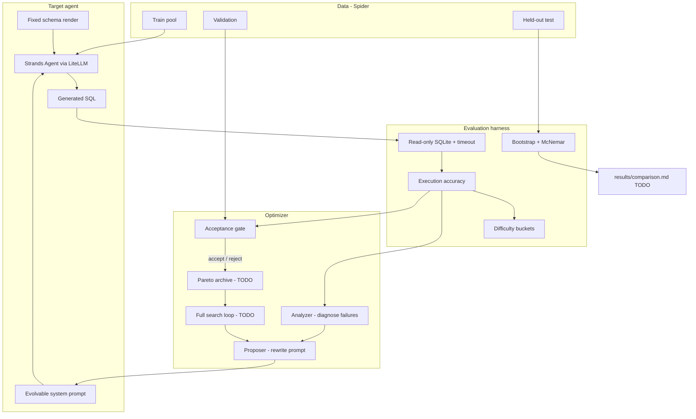

# Delta

> **Work in progress — not finished.**  
> Measurement harness, splits, stats, and analyzer/proposer agents are in place.  
> The full optimization loop and DSPy/GEPA comparison table are **not done yet**.

A self-improving **text-to-SQL** system: a target agent writes SQL from natural language, an
optimizer diagnoses failures and proposes a better system prompt, and only improvements that
survive held-out evaluation are kept.

Named for what it measures: the **delta**, with a confidence interval.

---

## Status

| Area | State |
|---|---|
| Execution + scoring harness | Done |
| Target agent (SQL writer) | Done |
| Seeded train/val/test splits | Done |
| Bootstrap / McNemar / acceptance primitives | Done |
| Analyzer + proposer agents | Done (offline mock OK; live reflection checkpoint pending) |
| Full optimization loop (Phase 4) | **Not done** |
| Random search + DSPy MIPROv2 + GEPA comparison | **Not done** |
| Final `results/comparison.md` table | **Not done** |

**Interim finding** (100 stratified Spider examples, Groq `llama-3.1-8b-instant`):

| Condition | Accuracy |
|---|---|
| Weak seed prompt (v0) | **75%** |
| Hand-tuned human prompt | **74%** |
| Gap | **−1%** |

The original “weak → human ≥10 points headroom” gate did not hold on this sample. The plan
now is to evaluate the optimizer against random search / DSPy from the weak seed, and treat
hand-tuned as a reference line. See [`results/real_path.json`](results/real_path.json).

---

## What it does

1. A **target agent** turns a natural-language question + database schema into SQL.
2. Generated SQL is **executed** and checked against gold (execution accuracy — no LLM judge).
3. An **analyzer** reads failures and writes a short diagnosis.
4. A **proposer** drafts a revised system prompt.
5. Search keeps candidates that improve validation without tanking a difficulty bucket.
6. A **paired statistical test** on a held-out test set is the confirmatory check.
7. The same splits/scoring will compare: weak seed, human prompt, random search, DSPy
   MIPROv2, DSPy GEPA, and Delta’s loop.

The propose/evaluate/keep loop is **not claimed as novel** (APE → OPRO → DSPy/GEPA). The
deliverable is a careful comparison. See [docs/RELATED_WORK.md](docs/RELATED_WORK.md).

---

## Architecture

Only the **system prompt** evolves. Schema rendering and question formatting stay fixed so
accuracy differences can be attributed to the instruction text.



### Components

| Path | Role |
|---|---|
| `delta/evalh/` | Dataset loaders, SQLite execution, scoring, splits, difficulty buckets, stats |
| `delta/target_agent/` | Prompt versions, schema render, thin SQL agent |
| `delta/llm/` | Providers (Strands/LiteLLM), disk cache, mock client, rate-limit pacing |
| `delta/optimizer/` | Gate, analyzer, proposer (full loop not wired yet) |
| `scripts/` | Spider download, baseline, real-path check, reflect checkpoint |
| `docs/` | Project plan / log, related work |
| `data/splits.json` | Seeded train / val / test ids (val/test disjoint by database) |

### Data flow (one candidate)

1. Evaluate prompt on a minibatch → per-example traces (SQL, pass/fail, bucket).
2. Analyzer summarizes failure modes from failed traces.
3. Proposer emits a revised system prompt.
4. Acceptance gate checks validation lift and per-bucket regressions.
5. Accepted prompts enter the archive; rejected ones are discarded.
6. After search, confirmatory stats run once on held-out test.

Longer narrative: [docs/PROJECT.md](docs/PROJECT.md).

---

## Plan

| Phase | Deliverable | Status |
|---|---|---|
| 0 | Harness, scoring, offline fixture, Spider downloader | Done (`v0.1`) |
| 1 | Target agent, eval harness, mock baseline | Done |
| 2 | Splits, difficulty buckets, stats, gate primitives | Done (`v0.2`) |
| 3 | Analyzer + proposer | Mostly done |
| 4 | Pareto archive + optimization loop | **TODO** |
| 5 | Random / MIPROv2 / GEPA comparison table | **TODO** |
| 6–7 | Routing polish, docs/results | Partial |

---

## Stack

- Python 3.11
- Spider 1.0 (execution accuracy; downloaded, not vendored)
- Target model: Groq `llama-3.1-8b-instant`
- Reflection (planned): Gemini Flash; optional Anthropic
- Strands Agents + LiteLLM
- sqlglot, pytest, ruff

---

## Quickstart

**Offline (no API key):**

```bash
make install
source .venv/bin/activate
make sample-db
make test
make baseline MOCK=1
make reflect MOCK=1
```

**With a real model:**

1. Copy `.env.example` → `.env` (never commit `.env`).
2. Set `GROQ_API_KEY` from [console.groq.com](https://console.groq.com) (keys look like `gsk_...`).
3. Optional: `GEMINI_API_KEY` for reflection.
4. Download Spider and run:

```bash
make spider
python scripts/run_real_path.py --n 100 --seed 0 --save
python scripts/run_reflect_checkpoint.py   # needs reflection key unless --mock
```

---

## Design choices

1. **Decoupled gate** — permissive rule during search; strict bootstrap/McNemar once on test.
2. **Database-disjoint val/test** — a prompt cannot be tuned to a schema it is later scored on.
3. **Per-difficulty regression guards** — no trading easy questions for hard ones unnoticed.
4. **Random-search ablation** (planned) — does reflection beat undirected sampling?
5. **Mock is for CI only** — mock “improvements” are skill-keyword triggers, not real results.

---

## License

MIT for this code. Spider is CC BY-SA 4.0 and is downloaded, not vendored.
