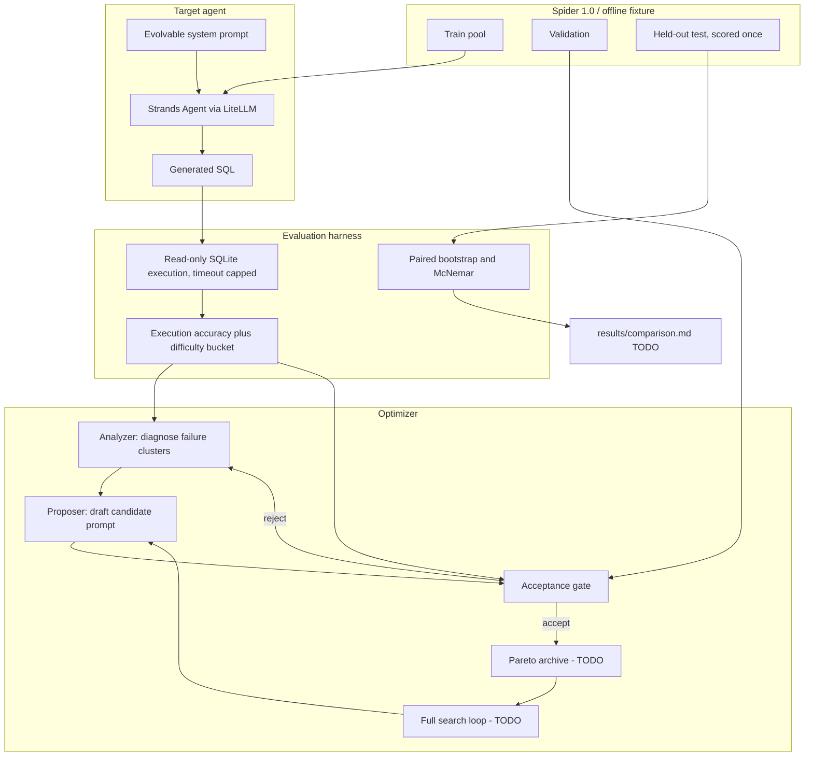

# Delta: Project Plan and Implementation Log

A single reference covering what Delta is, why it is designed the way it is, what has been
built so far, and what remains.

- **Repository:** https://github.com/sssahoo-lang/delta
- **Language:** Python 3.11
- **Status:** Work in progress. Phases 0–3 largely in place (harness, splits, stats,
  analyzer/proposer). Full optimization loop and comparison table not done yet.

---

## 1. What Delta is

A self-improving agent system. A **target agent** writes SQL from natural-language questions.
An **analyzer agent** reads the target's failures and diagnoses why they happen. A **proposer
agent** drafts a revised prompt. An **acceptance gate** then runs a statistical test on
held-out data and admits the new prompt *only if* the improvement is real.

The name is the point: the delta, with a confidence interval, is the thing being measured.

Most prompt-tuning projects stop at "I changed the prompt and the number went up," which on a
few hundred examples is usually noise. Delta treats each candidate prompt as a hypothesis that
must survive a test before it is believed.

### Why text-to-SQL as the target task

Because correctness is objectively decidable. A generated query either returns the same rows as
the gold query or it does not. There is no rubric, no LLM-as-judge, and no subjective grading, so
"it improved" is provable rather than asserted.

---

## 2. Honest positioning against prior art

**The propose/evaluate/keep loop is not novel, and the project does not claim it is.** This
matters: a reviewer who knows the field will immediately ask "why not just use DSPy?", and the
project needs a real answer.

The lineage:

| Work | Year | Contribution |
|---|---|---|
| [APE](https://arxiv.org/abs/2211.01910) | ICLR 2023 | First to treat the instruction as a program: LLM proposes candidates, select by score |
| [OPRO](https://arxiv.org/abs/2309.03409) | ICLR 2024 | LLM as optimizer over prior solutions and their scores |
| [PromptBreeder](https://arxiv.org/abs/2309.16797) | 2023 | Evolves task-prompts *and* the mutation-prompts (self-referential) |
| [TextGrad](https://www.nature.com/articles/s41586-025-08661-4) | Nature 2025 | Backpropagates textual feedback through a computation graph |
| DSPy MIPROv2 | ongoing | Bayesian optimization over joint instruction and demo space |
| [GEPA](https://arxiv.org/abs/2507.19457) | **ICLR 2026 Oral** | Reflective evolution over a Pareto frontier; beats GRPO by ~6% using up to 35x fewer rollouts |
| [ADAS](https://arxiv.org/abs/2408.08435) | ICLR 2025 | Meta agent writes new agent *code*, not just prompts |
| [Darwin Godel Machine](https://arxiv.org/abs/2505.22954) | 2025 | Agent edits its own codebase; SWE-bench 20% to 50% |

GEPA ships inside `dspy` 3.2.1 today. So the honest framing is:

> Delta does not contribute the idea. It contributes a rigorous implementation of it in a
> specific domain, measured against the state of the art, including an ablation that tests
> whether reflection beats undirected random sampling at all.

**The deliverable is the comparison table, not the loop.** Six conditions on identical splits
with identical scoring: weak baseline, human hand-tuned prompt, random search, DSPy MIPROv2,
DSPy GEPA, and Delta's own optimizer.

If GEPA wins, that gets reported. Implementing and fairly evaluating against an ICLR Oral method
is the accomplishment; a suspicious win would not be.

---

## 3. Benchmark choice

**Spider 1.0 dev, execution accuracy.** Deliberately *not* BIRD or Spider 2.0.

A [CIDR 2026 paper](https://www.cidrdb.org/cidr2026/papers/p5-jin.pdf) had experts re-verify these
benchmarks and found annotation error rates of **52.8% in BIRD Mini-Dev** and **62.8% in Spider
2.0-Snow**. Re-scoring 16 open-source BIRD agents on a corrected subset moved execution accuracy
by between -7% and +31% relative and shifted rankings by up to nine positions. Rank correlation
with the full dev set fell from 0.85 to 0.32 after correction.

Any few-point improvement measured on those sets could be label noise. Spider 1.0 is CC BY-SA 4.0,
its leaderboard has been frozen since February 2024 so comparison points are stable, and 1,034 dev
examples is enough for meaningful confidence intervals.

### The data acquisition trap

The widely used `xlangai/spider` HuggingFace parquet contains **only question/SQL pairs and no
databases**, which makes execution accuracy impossible to compute from it. Delta instead pulls
`HAL-9001/spider-databases`, a 206 MB re-host of the canonical Yale distribution that includes the
SQLite files, pinned by SHA256 so results cannot drift underneath the benchmark.

### Documented headroom

There is real room for a prompt optimizer to demonstrate something:

- Llama 3.1 8B on Spider dev, naive few-shot: **55.0%** execution accuracy ([STaR-SQL, ACL 2025](https://aclanthology.org/2025.acl-long.1187.pdf))
- Llama 3 8B, zero-shot schema only: **60.9%**; with sample rows: **67.0%**; few-shot with rows: **70.8%** ([Databricks](https://www.databricks.com/blog/improving-text2sql-performance-ease-databricks))
- So roughly **10 to 15 points are reachable by prompt and context changes alone**, no weight updates
- Gains concentrate in the hard and extra-hard buckets (31.3% to 44.6% extra-hard in the Databricks run), which is why per-difficulty reporting is mandatory

A cautionary data point from the same literature: DIN-SQL, a strong pipeline designed for GPT-4,
actually *hurt* the 8B model, dropping it to 45.2%. Prompts do not transfer across model scales,
which is the central argument for per-model optimization.

---

## 4. Models and infra

| Role | Default |
|---|---|
| Target agent (SQL writer) | Groq `llama-3.1-8b-instant` |
| Analyzer + proposer | Gemini Flash (optional Anthropic fallback) |
| Offline / CI | Deterministic mock client |

Evaluation groups examples by `db_id` so shared prompt prefixes (system + schema) can be
cached across questions in the same database. A disk cache stores completed completions for
reproducible reruns. Rate-limit pacing and retries live in `delta/llm/providers.py`; token
accounting lives in `delta/llm/budget.py`.

Splits are right-sized for search (~100 train / ~350 val / ~400 test); see `data/splits.json`.

---

## 5. Architecture



Only the **system prompt** evolves. The user message (schema plus question) is rendered
identically for every condition, so any measured accuracy difference is attributable to the
instruction text and nothing else.

---

## 6. The five decisions that make this credible

These separate the project from a weekend prompt-tweaking script.

1. **Decoupled acceptance, not an underpowered in-loop significance test.** Search accepts on a
   permissive rule (positive point estimate on validation, no per-difficulty regression beyond
   tolerance). The paired bootstrap and McNemar test run once on held-out test, Holm-corrected
   across the comparison table. The original 95% in-loop gate is logged as a counterfactual
   ablation — on 200–350 examples it has only ~25% power to detect a true +5 point gain, so
   using it to stop the search would measure "gated vs ungated" rather than proposal quality.
2. **Three-way split, test set touched exactly once.** Optimize on train, screen/accept on
   validation, report on test one time. Validation and test are disjoint **by database**.
3. **Per-difficulty regression guards.** Accept only if no difficulty bucket regresses beyond
   tolerance. Aggregate accuracy hides a prompt trading away easy questions to win hard ones.
4. **Pareto archive, not a single incumbent.** Keep the frontier of candidates that each win on
   some subset, following GEPA's design, so the search preserves stepping stones instead of getting
   trapped in a local optimum.
5. **Random-search ablation.** Same candidate budget, proposals generated with no failure analysis.
   If reflection does not beat undirected sampling, that is a real finding and it gets reported.

---

## 7. Phase status

| Phase | Deliverable | Status |
|---|---|---|
| 0 | Execution harness, scoring, offline fixture, Spider downloader | **Done**, tag `v0.1` |
| 1 | Target agent, evaluation harness, baseline number | **Done**, commit `57aa73f` |
| 1.5 | Real-path token measurement; live Groq headroom gate | **Done — gate FAILED** (v0 75%, hand-tuned 74%, gap −1% on n=100) |
| 2 | Seeded splits, difficulty bucketing, bootstrap/McNemar, gate | **Done**, tag `v0.2` |
| 3 | Analyzer and proposer agents | **Done** (mock checkpoint); real Gemini checkpoint pending |
| 4 | Pareto archive, optimization loop | Not started (gate + reflect primitives exist) |
| 5 | Random search, DSPy MIPROv2 and GEPA baselines, comparison table | Not started |
| 6 | Multi-model routing polish | Partially done (token budget tracker exists) |
| 7 | Related-work doc, README, CI | **Done** for scaffolding; results table still open |

Estimated remaining: roughly 2 to 3 weeks part-time.

---

## 8. What is implemented

34 tracked files, 80 tests, ruff clean.

### `delta/evalh/` — the measurement core

**`execute.py`** runs model-generated SQL against SQLite. Two properties matter more than speed,
because the SQL is untrusted:

- The database is opened **read-only** via `file:...?mode=ro`, so a generated `DROP TABLE` fails at
  the SQLite level rather than relying on us to detect write statements by parsing, which is
  defeatable.
- Execution is bounded in **time** (a `threading.Timer` calling `conn.interrupt()`) and in **rows**,
  since generated SQL can produce accidental cross joins that never finish.

A failed query is a scored outcome, not an exception. Syntax errors, missing columns, and timeouts
are all just "incorrect."

**`score.py`** implements execution accuracy following Spider conventions:

- Rows compared as a **multiset** unless the gold query contains `ORDER BY`, in which case order
  is significant
- **Column order is not significant**; a permutation search runs when direct comparison fails
- Values normalized so `3` and `3.0` match and float noise does not cause false negatives
- A broken gold query is surfaced as `GOLD_FAILED`, distinctly from a wrong prediction, so a bad
  benchmark row is never silently charged to the model

Documented divergence from the official evaluator: the official *test-suite* metric executes
against several perturbed database copies to catch predictions that are only accidentally right.
Delta scores against the single shipped database, which is marginally more generous. It is applied
identically to every condition, so it does not bias the deltas between them.

**`dataset.py`** normalizes the offline fixture and Spider to one `Example` shape, which is what
lets the pipeline be developed against 15 questions and then pointed at 1,034 without touching
anything but the loader call.

**`evaluate.py`** produces `EvalReport`. The important design choice is that it keeps the
**per-example** outcome keyed by example id, not just an average. Aggregate accuracy cannot support
a paired statistical test, and keying by id rather than position means two reports evaluated in
different orders cannot silently misalign.

### `delta/llm/` — model access

**`providers.py`** is a uniform `ModelClient` interface over Strands' LiteLLM provider, so every
provider uses one code path. A fresh Strands `Agent` is constructed per call, deliberately: the
agent object accumulates conversation history, and carrying history between benchmark questions
would leak one answer into the next and quietly inflate accuracy.

**`cache.py`** is a content-addressed disk cache, built in Phase 1 rather than retrofitted. Three
reasons: cost (a hit consumes no rate-limit quota), reproducibility (a reported number can be
regenerated byte-identically), and iteration speed (a cached pass finishes in under a second
instead of the 40 minutes that 30 requests/minute imposes). Writes are atomic via a temp file, so
a crash cannot leave a partial entry.

**`mock.py`** is a deterministic offline model. A mock that always returned the same string would
test the plumbing but not the *optimizer*, because every candidate prompt would score identically
and the gate would never have anything to accept. So this mock is **prompt-sensitive**: it owns six
SQL skills (`GROUP`, `JOIN`, `ORDER`, `LIMIT`, `SUBQUERY`, `DISTINCT`) and a skill is only available
if the system prompt actually instructs the model to use it. A better prompt genuinely produces
better SQL, which makes CI both free and meaningful.

Two honesty properties are enforced by tests: it never sees gold SQL, and it is fully deterministic.

### `delta/target_agent/` — the thing being optimized

**`prompt.py`** holds `PromptVersion` (content-hashed id, parent id, origin, for auditing the
search lineage) plus two seeds. `V0_WEAK` is deliberately minimal, stating the task and nothing
about how to do it. That is the experimental setup, not laziness: an optimizer needs real failures
to find. `V_HANDTUNED` was written before any optimizer run, so it is a fair human baseline rather
than a post-hoc reconstruction.

A 2,400-character cap acts as a regularizer, since published ablations find the proposer otherwise
appends caveats indefinitely, inflating cost and eventually hurting accuracy.

**`schema_render.py`** renders `CREATE TABLE` DDL, held fixed across all conditions. If schema
formatting changed alongside the prompt, an accuracy delta could not be attributed to either.

**`agent.py`** is deliberately thin: no retries on bad SQL, no self-correction, no few-shot
injection. Any of those would improve accuracy in ways that confound the measurement.

Its one non-trivial piece is `extract_sql`, which tolerates markdown fences, prose lead-ins
("Here is the query:"), and trailing explanations. This is measured, not cosmetic: if extraction
failed on well-formed answers, the v0 baseline would be understated and every later improvement
would partly reflect the parser getting lucky.

### Entry points

- `delta/cli.py` — `delta diagnose` scores a prompt and shows failures; `delta info` reports what
  is runnable right now
- `scripts/make_sample_db.py` — builds the offline fixture
- `scripts/download_spider.py` — checksum-verified Spider download
- `scripts/run_baseline.py` — the baseline number, with a `--compare` headroom check

---

## 9. Current results

Offline fixture, 15 questions, deterministic mock model:

| Condition | Overall | easy | medium | hard | extra |
|---|---|---|---|---|---|
| v0 (weak baseline) | **26.7%** (4/15) | 80% | 0% | 0% | 0% |
| Hand-tuned (human) | **60.0%** (9/15) | 100% | 40% | 66.7% | 0% |
| **Headroom** | **+33.3%** | | | | |

The `extra` bucket stays at 0% for both because it requires three-table joins, which the mock
cannot reach. That ceiling is intentional: it keeps some questions unreachable so the mock is not
trivially solvable.

These are *mock* numbers, validating the machinery. Real Spider numbers require API keys and
arrive in Phase 5.

---

## 10. Bugs found, and how

Every one of these was caught by a test rather than by reading code, which is the argument for
writing the harness before the optimizer.

**The fixture had a degenerate question.** Question s013 asked for instructors who teach no course,
but every instructor taught one, so it returned an empty set that any broken query would satisfy.
Fixed by adding two course-less instructors.

**Three of six mock skills were dead.** `JOIN`, `SUBQUERY`, and `DISTINCT` were declared and
gated but never affected generation. The consequence was serious: the hard and extra buckets sat at
0% and were unreachable by *any* prompt, which would have made Phase 4's per-difficulty regression
guards appear to work while testing nothing. A test asserting every declared skill changes some
output caught it.

**Join partner selection was far too eager.** Scoring candidate tables by column-name overlap meant
`dept_name` matched the word "names", so "the names of students" dragged in a second table and
emitted a spurious join. Easy-bucket accuracy collapsed from 100% to 40%. Fixed by ignoring generic
column fragments (`name`, `id`, `title`, and so on) and requiring a minimum evidence score.

**"one million" parsed as 1**, because the number-word dictionary was iterated in insertion order
and the shorter "one" matched first. Fixed by matching longest phrase first.

**Mid-sentence capitalized words became invented filters.** "How many students... ? Show the
department name" produced `WHERE name = 'Show'`, because sentence-initial detection only checked
the first sentence. Fixed by checking every sentence boundary.

The last two mattered beyond tidiness: both produced failures that *no prompt could fix*, which
would have put a false ceiling on the optimizer and made its measured gains look smaller than they
are.

---

## 11. How to run it

Fully offline, no API key:

```bash
make install
source .venv/bin/activate
make sample-db
make test                     # 80 tests
make baseline MOCK=1          # the baseline number
python scripts/run_baseline.py --mock --compare    # headroom check
delta info                    # what is runnable right now
```

For real-model runs, copy `.env.example` to `.env` and set `GROQ_API_KEY`
([console.groq.com](https://console.groq.com)); optionally `GEMINI_API_KEY` for reflection
([aistudio.google.com](https://aistudio.google.com)). Then
`python scripts/download_spider.py` fetches the benchmark.

---

## 12. Immediate next steps

**Headroom gate failed on real Groq** (`results/real_path.json`): v0 **75%**, hand-tuned
**74%**, gap **−1%** on 100 stratified Spider examples. Llama 3.1 8B already follows the weak
seed well enough that the human prompt does not beat it. Building Phase 4 on this setup would
optimize into noise.

Options before continuing:
1. Strengthen the human baseline (sample rows in schema; tighter rules) and re-measure.
2. Change the seed so there is real climb room (weaker / differently broken v0).
3. Reframe the experiment: optimize from v0 and compare Delta vs random/DSPy without requiring
   hand-tuned to beat v0 by 10 points (hand-tuned stays a reference line, not a headroom proof).

Do not start the full optimization loop until one of these is chosen.

### Known open items

- Live Gemini reflect checkpoint still pending
- Rate-limit pacing/retries in place after early provider 429s
- Results table and DSPy baselines still open (Phase 5)

---

## 13. Resume bullets this produces

To be filled from `results/metrics.json` after Phase 5:

- Built a self-improving multi-agent system (Strands Agents SDK) that optimizes a text-to-SQL
  agent's prompt via reflective failure analysis, improving Llama-3.1-8B execution accuracy on
  Spider 1.0 from [B]% to [A]% on a held-out set of [N] examples, validated by paired bootstrap and
  McNemar testing.
- Benchmarked the custom optimizer against DSPy MIPROv2 and GEPA (ICLR 2026) plus a random-search
  ablation on identical splits and scoring, establishing that reflective proposal outperformed
  undirected sampling by [D] points.
- Engineered a statistically gated acceptance loop rejecting candidate prompts without significant
  held-out improvement or with per-difficulty regressions, with content-addressed response caching
  and two-tier model routing (fast target model + stronger reflection models).
